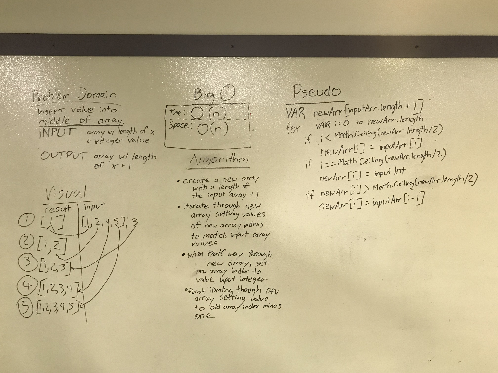

# Insert and shift an array

## Challenge

Write a method called ArrayShift which takes in an array and the value to be added. Without utilizing any of the built-in methods available to your language, return an array with the new value added at the middle index.

## Approach and Efficiency

Time Complexity: O(n)

Space Complexity: O(n)

> Both time and space complexity are O(n). Since we're constrained to only arrays in this particular challenge, this approach requires a construction of a new array and populating it in relation of original array lengh n + 1.

## Solution

