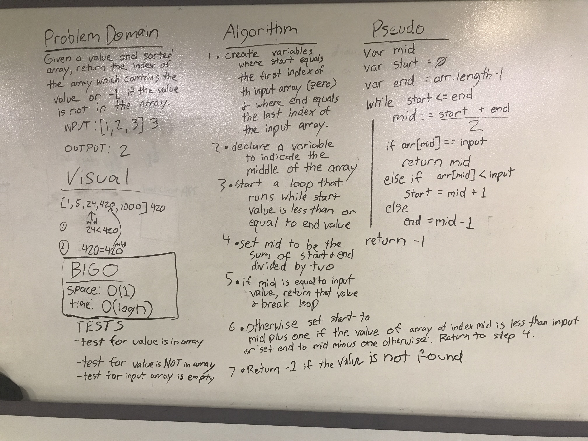

# Binary Search

Binary search, also called logarithmic search, is a search algorithm that finds and returns the index of a targeted value in a given array.

## Challenge

Write a function called BinarySearch which takes in 2 parameters: a sorted array and the search key. Without utilizing any of the built-in methods available to your language, return the index of the array’s element that is equal to the search key, or -1 if the element does not exist.

## Approach and Efficiency

Time Complexity: O(log n)
> Time complexity is O(log n) due to the nature of binary searching. We're constantly halving the search range whenever we did not "guess" the correct index.

Space Complexity: O(1)
> Space complexity is constant as we're only keeping track of three (additional) variables : Start, End, Mid.

## Solution
