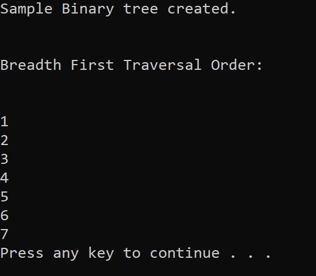

# Breadth First Traversal

Breadth first traversal of a Tree data structure.

## Challenge

Write a breadth first traversal method which takes a Binary Tree as its unique input. Without utilizing any of the built-in methods available to your language, traverse the input tree using a Breadth-first approach; print every visited node’s value.

## Approach and Efficiency

Time Complexity: O(n)
> Time complexity is O(n) due to needing to traverse through the entire tree.

Space Complexity: O(w)
> Space complexity w, depending on the width of the tree.

## Solution

## Test

