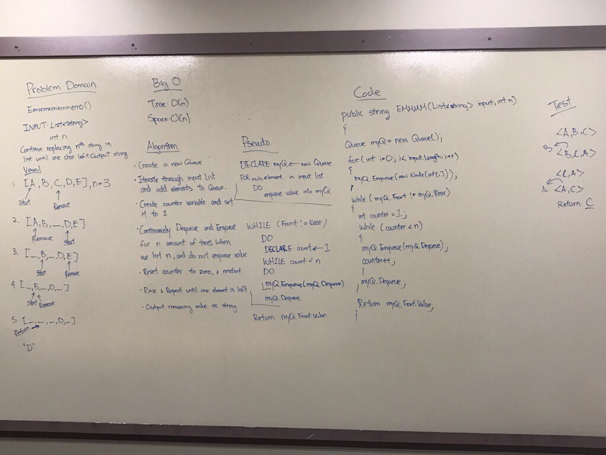

# Eeney Meeney Miney Moe

## Challenge

Write a function called `EeneyMeeneyMineyMoe()` that accepts a list of strings and an int `n`. Start at the beginning of the list and count up to `n` and remove the person at the current index from the list. Keep counting from that index and count up to `n` over and over until only one person is left in the list. Return a string with the name of the last person left in the list.

## Approach and Efficiency

For this challenge, data structure Queue is used for a FIFO flow.

Time:

> Time is O(n) due to the method looping to remove elements until one is left in queue.

> Space is O(n) due to having to translate an arry to a Queue, which depends on the length of the array.

## Solution

