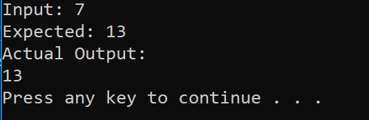

# Fibonacci

Fibonacci sequence: The third number of the sequence and beyond is the sum of the two preceding numbers.

## Challenge

Write a function called Fibonacci which takes in 1 parameters: the nth sequence of the fibonacci sequence. The function returns the value.

## Approach and Efficiency

Time Complexity: O(log n)
> Time complexity is O(n) as the times the loop will run is dependent on the input.

Space Complexity: O(1)
> Space complexity is constant as we're only keeping track of constant (additional) variables : prevNum, currNum, temp, and so on.

## Solution

