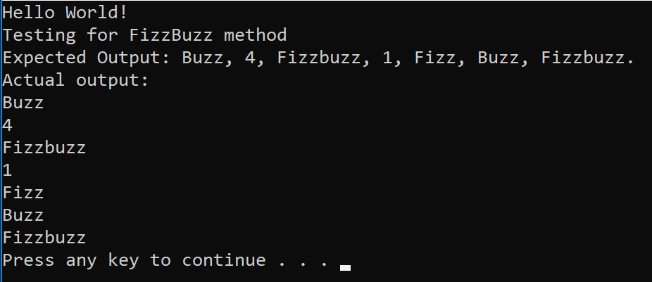

# Fizzbuzz Tree

## Challenge

Write a function called FizzBuzzTree which takes a tree as an argument.
Without utilizing any of the built-in methods available to your language, determine whether or not the value of each node is divisible by 3, 5 or both and output the appropriate value respectively.

## Approach and Efficiency

>Time: O(n) We have to search through each node individually across the entire tree, which is dependent on the tree having n nodes.

>Space: O(1) Since we're simply traversing and outputting, no additional memory is allocated for this method.

## Solution

## Testing

