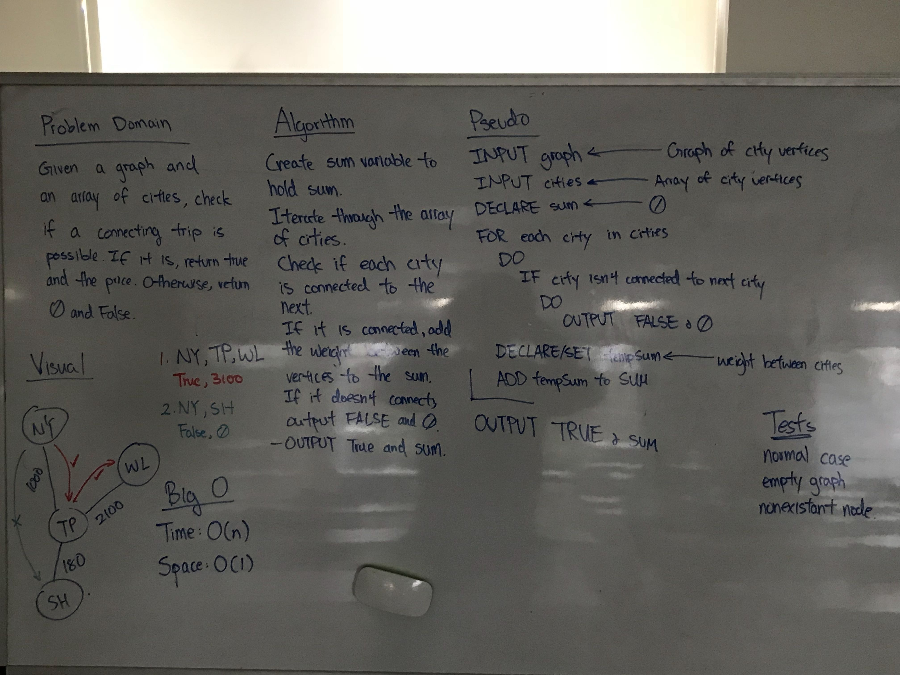

# Get Edge

## Challenge

Write a function based on the specifications above, which takes in a graph, and an array of city names. Without utilizing any of the built-in methods available to your language, return whether the full trip is possible with direct flights, and how much it would cost.

## Approach and Efficiency

>Time: O(n) Dependent on how many cities there are in input.

>Space: O(1) We're only tracking constant variables regardless of size.

## Solution

