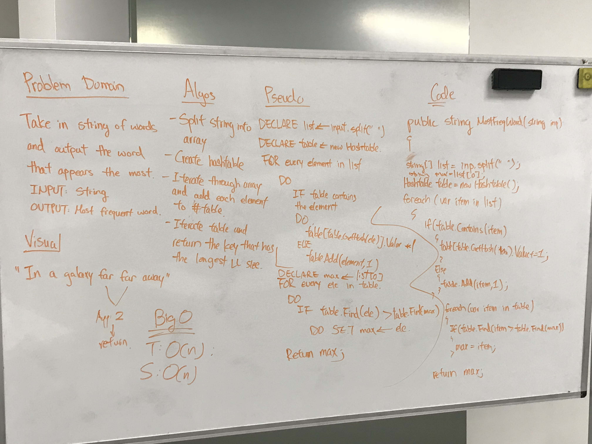

# Find Most Common Word

Finds the word with the most occurence.

## Challenge

Write a function called MostCommonWord that returns the word that occurs most frequently in the string. You can assume that there will be no punctuations.

## Approach and Efficiency

Time Complexity: O(n)
> Time complexity is O(n) due to the need to iterate through an array generated by the input.

Space Complexity: O(n)
> Space complexity is O(n) due to the creation of a Hashtable to store key/value pairs.

## Solution

