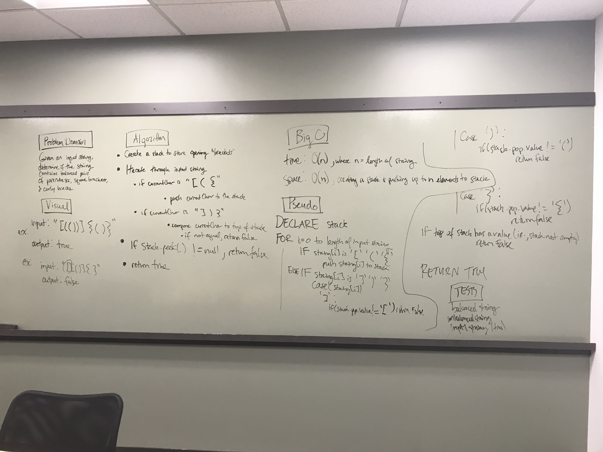

# Multi Bracket Validation

## Challenge

Create a method that takes in a string with or without brackets contained. Check if the brackets in the string are balanced or not.

```
"{([])}" => TRUE
"{[}]" => FALSE
```

## Approach and Efficiency

For this challenge, data structure Stack was utilized in a FILO flow.

Time:

> Time is O(n) due to the requirement to iterate through the string.

> Space is O(n) due to how our stack is implemented. We require the values to be stored in nodes, therefore there will be n memory allocated.

## Solution

