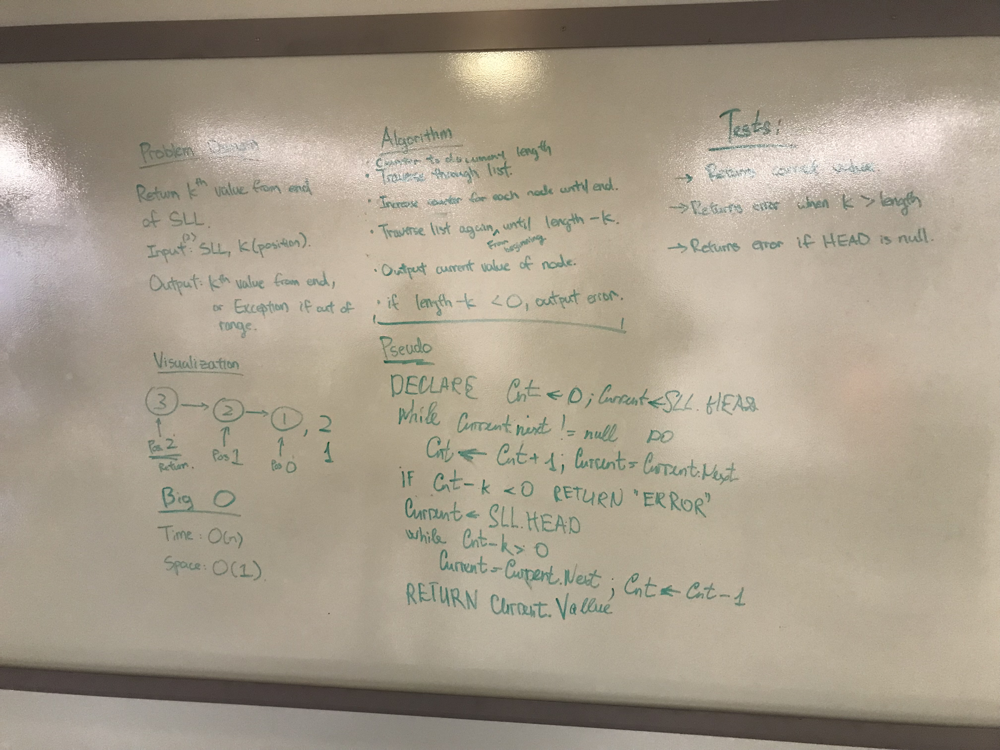

# Return Kth From End

Given a Singly Linked List, return the kth element from the tail end of the list starting from 0.

## Challenge

Write a method for the Linked List class which takes a number, k, as a parameter. Return the node’s value that is k from the end of the linked list. You have access to the Node class and all the properties on the Linked List class as well as the methods created in previous challenges. ​

## Approach and Efficiency

Time Complexity: O(n)
> Time complexity is O(n) due to the nature of linked list traversal.

Space Complexity: O(1)
> Space complexity is constant as we're only keeping track of constant variables (Current and count)

## Solution
