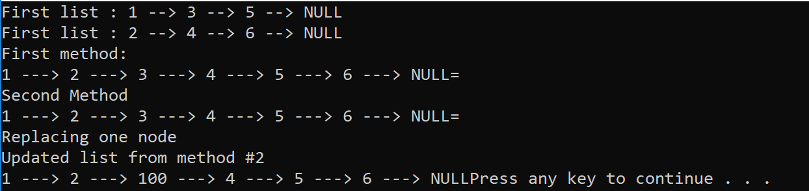

# Merge Linked List

Given two Singly linked lists, merge them in a zipper fashion so it's alternating.

## Challenge

Write a function called mergeLists which takes two linked lists as arguments. Zip the two linked lists together into one so that the nodes alternate between the two lists and return a reference to the head of the zipped list. Try and keep additional space down to O(1). You have access to the Node class and all the properties on the Linked List class as well as the methods created in previous challenges.

## Approach and Efficiency

Time Complexity: O(n)
> Time complexity is O(n) due to the nature of linked list traversal.

Method 1 (MergeLists)

Space Complexity: O(n)
> Space complexity is O(n) since we deliberately created new nodes instead of referencing existing ones, so that users can still manipulate the older lists without affecting the merged list.

Method 2 (MergeTwo)

Space Complexity: O(1)
> Space complexity is constant since we do not create new nodes, but instead create references.

## Solution
