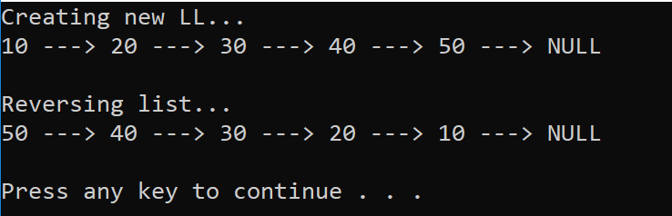

# Reverse a Linked List

Given a Singly Linked List, reverse it

## Challenge

Write a mthod for the Linked List class which takes in a Singly Linked List and reverse it.

## Approach and Efficiency

Time Complexity: O(n)
> Time complexity is O(n) due to the nature of linked list traversal.

Space Complexity: O(1)
> Space complexity is constant as we're only keeping track of constant variables (Next, Prev, Current)

## Solution
