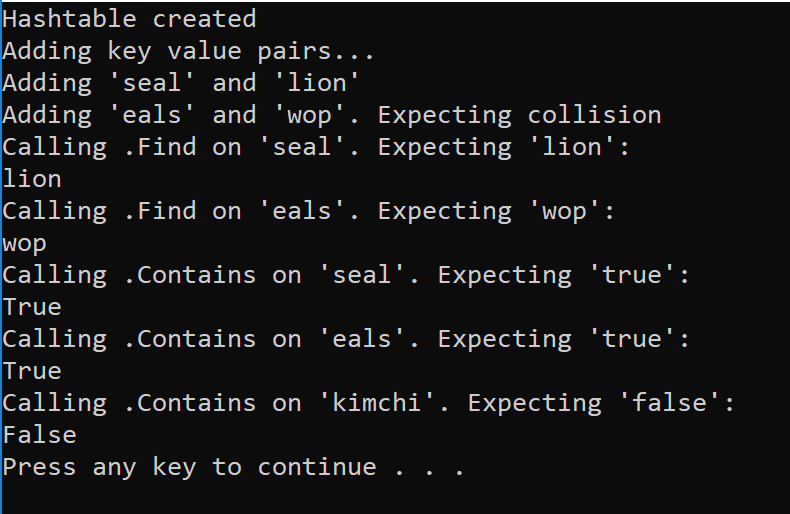

# Hash Tables

Hashtables are a data structure that utilize key value pairs. This means every Node or Bucket has both a key, and a value.

The basic idea of a hashtable is the ability to store the key into this data structure, and quickly retrieve the value. This is done through what we call a hash. A hash is the ability to encode the key that will eventually map to a specific location in the data structure that we can look at directly to retrieve the value.

Since we are able to hash our key and determine the exact location where our value is stored, we can do a lookup in an O(1) time complexity. This is ideal when quick lookups are required.

## Space and Time Complexity

GetHash(string key)

`GetHash` will accept a key as a string, conduct the hash, and then return the index of the array where the key/value should be placed.

> Time Complexity: O(1)

> Space Complexity: O(1)

Add(key, value)

`Add` Sends the key to the `GetHash` method. Once the method determines the index of where the key should be placed, it'll go to that index to check if a key already exists at that point. If it doesn't, add a new bucket in form of SLL. If it does, append the new key/value pair to the linked list.

> Time Complexity: Best case is O(1), unless a collision is hit. If collision is present, the time complexity changes to O(n).

>Space Complexity: O(1) as we're keeping track of constant variables.

Find(string key)

The `Find` takes in a key, gets the Hash, and goes to the index location specified. Once at the index location is found in the array, the algorithm will iterate through the bucket and see if the key exists and return the value.

> Time Complexity: Best case is O(1), unless there are multiple keys at the same index. If collision is present, the time complexity changes to O(n) dependent on length of LinkedList.

> Space Complexity: O(1) as we're keeping track of constant variables.

Contains(string key)

The `Contains` method will accept a key, and return a bool on if that key exists inside the hashtable. The method will call `GetHash` and check the hashtable if the key exists in the table given the index returned.

>Time Complexity: Best case is O(1), unless there are multiple keys at the same index. If collision is present, the time complexity changes to O(n) dependent on length of LinkedList.

> Space Complexity: O(1) as we're keeping track of constant variables.

## Visual

