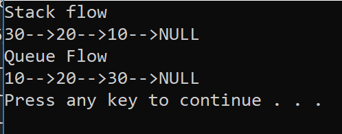

# Stack And Queue

Implements the Stack and Queue data structure. Stacks follow a FILO (First in last out) flow, while Queue follows a FIFO (First in first out) flow.

## Space and Time Complexity

Peek
- Returns the first/top node of the data structure.

> Time: O(1)

> Space: O(1)

Push
- Pushes a new node to the top of the stack.

> Time: O(1)

> Space: O(1)

Pop
- Removes the node on the top of the stack.

> Time: O(1)

> Space: O(1)

Enqueue
- Adds a new node to the rear end of queue.

> Time: O(1)

> Space: O(1)

Dequeue
- Removes the Front node of a Queue.

> Time: O(1)

> Space: O(1)

## Visual

