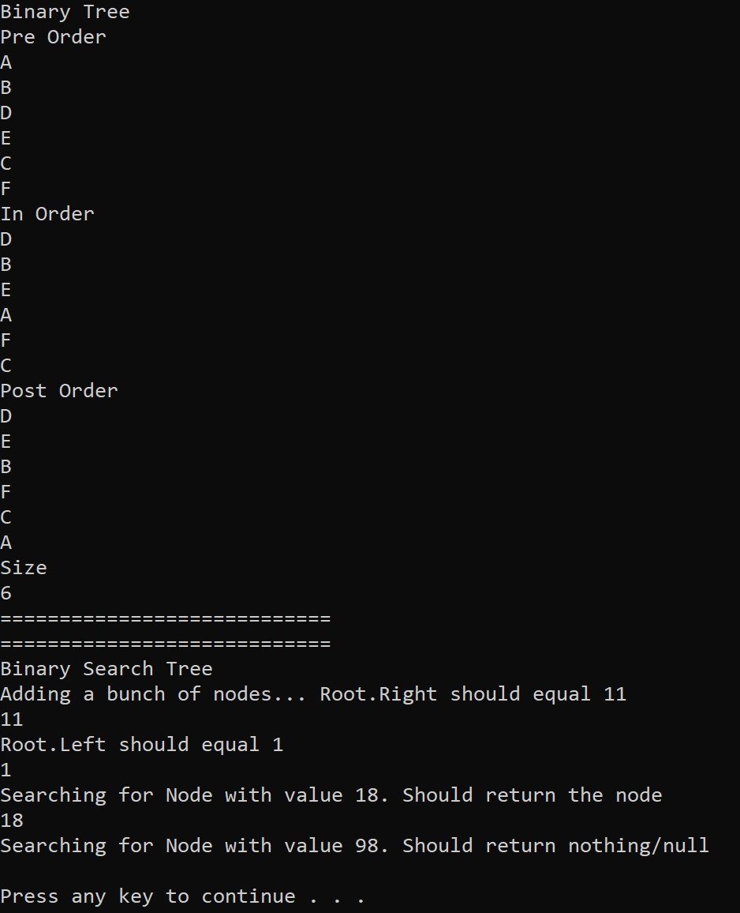

# Binary Trees and Binary Search Trees

Implements the standard Binary Tree with Nodes containing its own Value along with Left and Right children.

Binary Search Tree has the same structure as a standard Binary Tree, but with the added functionality of having all nodes sorted by their value. All nodes smaller than the root node goes to the Left, while values greater or equal than the root goes to the Right.

## Space and Time Complexity

Binary Tree
- PreOrder
- >Time Complexity: O(n). We go through all the nodes in a PreOrder fashion dependent on n nodes of the tree.

- >Space Complexity: O(n). We're generating a new List collection ordered by traversal.

- InOrder
- >Time Complexity: O(n). We go through all the nodes in an InOrder fashion dependent on n nodes of the tree.

- >Space Complexity: O(n). We're generating a new List collection ordered by traversal.

- PostOrder
- >Time Complexity: O(n). We go through all the nodes in a PostOrder fashion dependent on n nodes of the tree.

- >Space Complexity: O(n). We're generating a new List collection ordered by traversal.

BinarySearchTree

- Search
- >Time Complexity: O(log n). Since the tree is ordered, we will always traverse down half of the tree to reach the Target Node.

- >Space Complexity: O(1). No additional memory is allocated during method call.

- Add
- >Time Complexity: O(log n). Since the tree is ordered, we will always traverse down half of the tree to reach the Target Node for addition.

- >SPace Complexity: O(1). No additional memory is allocated during method call.

## Visual

